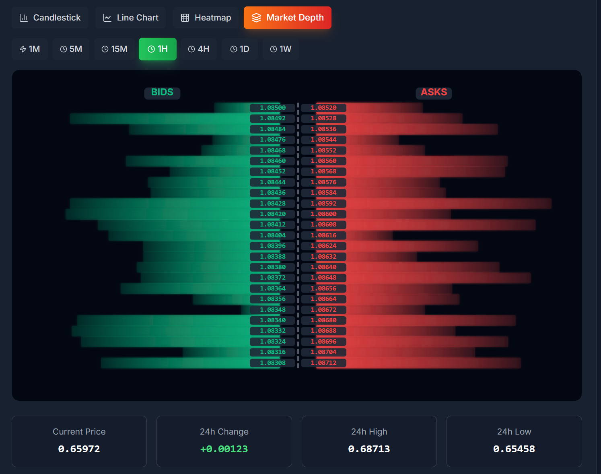
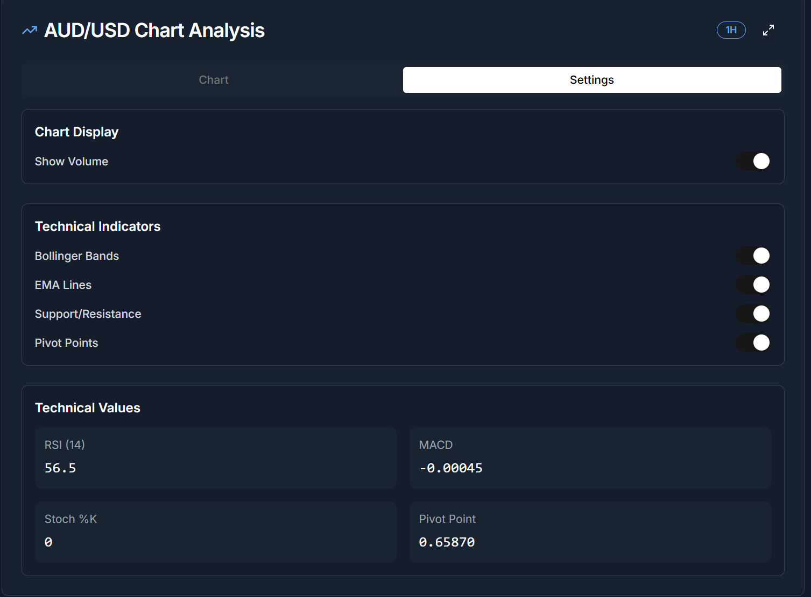

# ForexAI Miantsa ❤

A cutting-edge AI-powered Forex trading platform built with Next.js, TypeScript, and modern web technologies. This application provides professional traders with advanced charting tools, AI-driven trading signals, and comprehensive market analysis capabilities.

##  Features

### 📊 Advanced Charting System
- **Multiple Chart Types**: Candlestick, Line charts, Currency Strength Heatmap, and Market Depth visualization
- **Technical Indicators**: RSI, MACD, Bollinger Bands, EMA (20/50), Support/Resistance levels, Pivot Points, Stochastic Oscillator
- **Timeframes**: 1 Minute to 1 Week intervals
- **Interactive Features**: Fullscreen mode, volume display, customizable indicators
- **Real-time Data**: Live price updates and market data streaming

###  AI Trading Intelligence
- **Smart Recommendations**: AI-generated BUY/SELL/HOLD signals with confidence scores
- **Risk Assessment**: Automated risk level analysis (LOW/MEDIUM/HIGH)
- **Entry/Exit Points**: Precise entry prices, target prices, and stop-loss levels
- **Market Sentiment**: Overall market mood analysis with strength indicators
- **Expected Returns**: Projected profit calculations for each recommendation

###  Trading Tools
- **Live Dashboard**: Real-time profit/loss tracking with comprehensive metrics
- **Market Overview**: Multi-currency pair monitoring with spread information
- **Trading Strategies**: Trend-following, breakout, reversal, and scalping strategies
- **File Analysis**: Upload and analyze trading data files
- **Performance Metrics**: Win rate, total trades, active positions tracking

###  Professional UI/UX
- **Dark Theme**: Modern, eye-friendly dark interface optimized for long trading sessions
- **Responsive Design**: Works seamlessly on desktop, tablet, and mobile devices
- **shadcn/ui Components**: Beautiful, accessible UI components built on Radix UI
- **Smooth Animations**: Fluid transitions and interactive elements
- **Customizable Layout**: Flexible grid system for personalized workspace

## Tech Stack

- **Frontend**: Next.js 13 (App Router), TypeScript, React 18
- **Styling**: Tailwind CSS, shadcn/ui component library
- **Charts**: Custom SVG-based charting system with technical indicators
- **Icons**: Lucide React icon library
- **Forms**: React Hook Form with Zod validation
- **Data Visualization**: Recharts for additional charting capabilities
- **State Management**: React hooks and context API

##  Installation

1. **Clone the repository**
   ```bash
   git clone https://github.com/yourusername/forexai-miantsa.git
   cd forexai-miantsa
   ```

2. **Install dependencies**
   ```bash
   npm install
   # or
   yarn install
   # or
   pnpm install
   # or
   bun install
   ```

3. **Run the development server**
   ```bash
   npm run dev
   # or
   yarn dev
   # or
   pnpm dev
   # or
   bun dev
   ```

4. **Open your browser**
   
   Navigate to [http://localhost:3000](http://localhost:3000)

##  Deployment

### Vercel (Recommended)
1. Connect your GitHub repository to Vercel
2. Deploy automatically with zero configuration
3. Enjoy global CDN and edge functions

### Other Platforms
The app can be deployed to any platform supporting Next.js:
- Netlify
- AWS Amplify
- Digital Ocean App Platform
- Self-hosted with Docker

##  Project Structure

```
forexai-miantsa/
├── app/                    # Next.js app directory
│   ├── globals.css        # Global styles
│   ├── layout.tsx         # Root layout
│   └── page.tsx           # Main dashboard page
├── components/            # React components
│   ├── ui/               # shadcn/ui components
│   ├── TradingChart.tsx  # Advanced charting component
│   ├── TradingRecommendations.tsx  # AI signals
│   ├── MarketOverview.tsx # Market data display
│   ├── TradingStrategies.tsx # Strategy management
│   └── FileUpload.tsx    # File analysis tool
├── hooks/                # Custom React hooks
├── lib/                  # Utility functions and data
│   ├── mockData.ts      # Mock trading data
│   └── utils.ts         # Helper functions
└── public/              # Static assets
```

##  Key Components

### TradingChart Component
- Supports 4 chart types with advanced technical analysis
- Custom SVG rendering for optimal performance
- Real-time data updates and interactive features
- Fullscreen mode for detailed analysis

### AI Recommendations Engine
- Generates trading signals based on technical analysis
- Calculates confidence levels and risk assessments
- Provides actionable entry/exit points with stop-loss

### Market Overview
- Real-time price feeds for major currency pairs
- Spread monitoring and volume analysis
- Interactive pair selection and filtering

## 🔧 Configuration

### Environment Variables
Create a `.env.local` file in the root directory:

```env
# Add your environment variables here
NEXT_PUBLIC_API_URL=your_api_url
NEXT_PUBLIC_WS_URL=your_websocket_url
```

### Customization
- **Theme**: Modify colors in `tailwind.config.ts`
- **Charts**: Customize chart parameters in `components/TradingChart.tsx`
- **Indicators**: Add new technical indicators in `lib/mockData.ts`

## Screenshots

<div align="center">
  <table>
    <tr>
      <td align="center">
        <br/>
        <strong>Main Dashboard</strong><br/>
        Live trading overview with candlestick charts
      </td>
      <td align="center">
        <br/>
        <strong>Line Chart</strong><br/>
        Price movement with area fill visualization
      </td>
      <td align="center">
        <br/>
        <strong>Currency Heatmap</strong><br/>
        Currency strength analysis matrix
      </td>
      <td align="center">
        <br/>
        <strong>Market Depth</strong><br/>
        Bid/ask order book visualization
      </td>
    </tr>
    <tr>
      <td align="center">
        <br/>
        <strong>Chart Settings</strong><br/>
        Technical indicators and display options
      </td>
      <td align="center">
        <br/>
        <strong>Trading Strategies</strong><br/>
        Available trading strategy selection
      </td>
      <td align="center">
        <br/>
        <strong>AI Signals</strong><br/>
        Smart trading recommendations with confidence
      </td>
      <td align="center">
        <br/>
        <strong>Upload Analysis</strong><br/>
        File upload for custom data analysis
      </td>
    </tr>
  </table>
</div>

> **Note**: Place your 8 screenshots in a `screenshots/` folder in your repository root with the exact filenames shown above.

> **Note**: Replace the screenshot paths with your actual screenshot files. Place your 8 screenshots in a `screenshots/` folder in your repository root.

##  Contributing

1. Fork the repository
2. Create a feature branch (`git checkout -b feature/amazing-feature`)
3. Commit your changes (`git commit -m 'Add amazing feature'`)
4. Push to the branch (`git push origin feature/amazing-feature`)
5. Open a Pull Request

##  License

This project is licensed under the MIT License - see the [LICENSE](LICENSE) file for details.

---

**Disclaimer**: This application is for educational and demonstration purposes. Always perform your own analysis before making trading decisions. Trading forex involves substantial risk of loss and is not suitable for every investor. 
